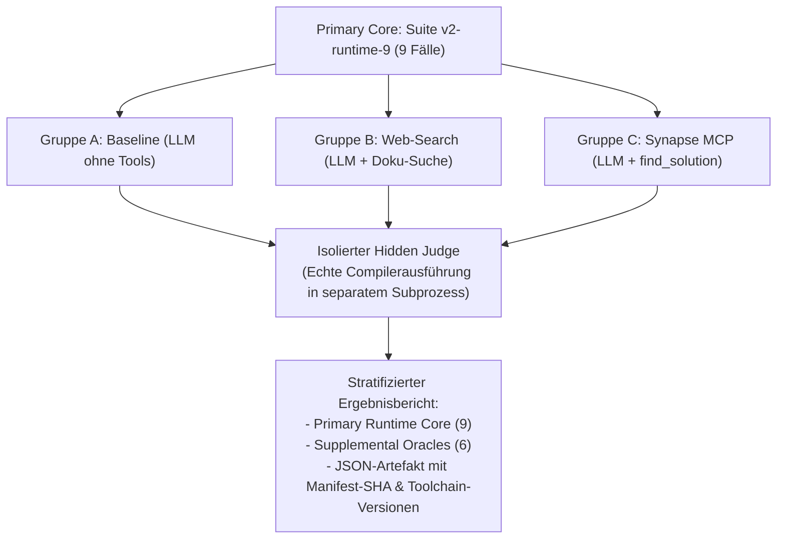

# Empirical Benchmark Specification: Suite v2 (2024–2026)

> **Ground Truth & Scientific Benchmark Registry**  
> *Kuratiert durch ChatGPT (Board of Advisors) und auditiert durch Grok (Red Team).*  
> **Manifest SHA-256:** `a076cff87dcf201aaeb6bf7931f1d05ea77f0da64a4a6a95a166067071ef018a`

---

## 1. Primärer Benchmark-Kern: `Suite v2-runtime-9` (Echte Compilerausführung)

Diese 9 Kernfälle werden auf echten, nativ installierten Compilern und Datenbank-Engines ausgeführt (0 Mocks, 0 statische Greps):

| ID | Familie & Toolchain | Bruch / Phänomen | Compiler- / Engine-Diagnose (Pre-Fail) |
|---|---|---|---|
| **P1** | Python 3.12 + NumPy 2.5.2 | NumPy 2.0 API-Alias-Entfernung (`np.NAN`) | `AttributeError: module 'numpy' has no attribute 'NAN'` |
| **P2** | Python 3.12 + HTTPX 0.28.1 + Starlette 0.37.2 | ASGITransport Migration & Loopback Route | `TypeError: Client.__init__() got an unexpected keyword argument 'app'` |
| **P3** | Python 3.12 (`-W error::DeprecationWarning`) | `datetime.utcnow()` Deprecation in favor of UTC timezone | `DeprecationWarning: datetime.datetime.utcnow() is deprecated` |
| **N1** | Node.js 22 LTS (V8 12.4 Engine) | Native Import Attributes (`with { type: 'json' }`) | `SyntaxError: Unexpected identifier 'assert'` |
| **N2** | TypeScript Compiler (`tsc --strict`) | Strict Null Safety on Optional Map Lookups | `error TS2322: Type 'number \| undefined' is not assignable to type 'number'` |
| **N3** | Node.js 22 + Express 5.0.1 + SuperTest | path-to-regexp v8 Brace Wildcard Routing (`/{*splat}`) | `TypeError: Missing parameter name at index 2: /*` |
| **R1** | Rust 1.85 / Cargo Toolchain (`build.rs`) | Cargo 1.80 `check-cfg` Invariant Declaration | `error: unexpected \`cfg\` condition name: \`has_accel\`` |
| **R3** | Rust 1.85 Compiler (`rustc --edition 2024`) | Edition 2024 Reserved Keyword `gen` | `error: expected identifier, found reserved keyword \`gen\`` |
| **S1** | Python 3.12 + DuckDB 0.10.0 (C++ Engine) | Removal of Implicit Substring Casting | `duckdb.BinderException: No function matches substring(INTEGER_LITERAL)` |

---

## 2. Ergänzende semantische Orakel (Supplemental Oracles, 6 Fälle)

Diese Fälle dienen als semantische Orakel für Konfigurationen, Spezifikationen und Systemrichtlinien:

| ID | Familie | Gegenstand | Prüfungsmodus |
|---|---|---|---|
| **R2** | Rust | Cargo Lockfile v4 Format Invariant | `toolchain_syntax_oracle` |
| **S2** | SQL | MySQL 8.4 `caching_sha2_password` Invariant | `static_semantic_oracle` |
| **S3** | SQL | SQLite 3.45+ JSONB BLOB Extraction | `static_semantic_oracle` |
| **D1** | Docker | Compose V2 Top-Level `version` Deprecation | `static_semantic_oracle` |
| **D2** | Docker | BuildKit Persistent Cache Mount Spec | `static_semantic_oracle` |
| **D3** | Docker | Ubuntu 24.04 PEP 668 Environment Policy | `static_semantic_oracle` |

---

## 3. Methodik & Versuchsdesign

