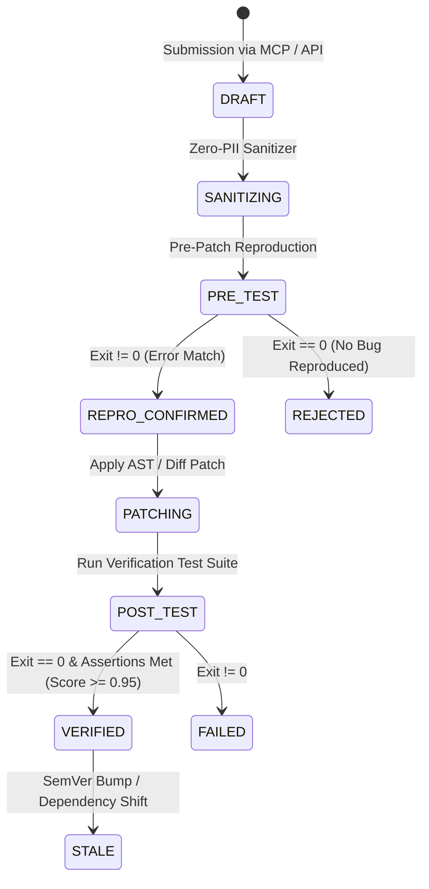

# Verification Pipeline & Sandbox Security Architecture

> **Synapse-Mesh (Exocortex): CI/CD for AI Knowledge**  
> *Deterministic, Execution-Proven Solutions for Autonomous AI Coding Agents.*

---

## 1. Epistemische Leitlinie: Evidence-First

In modern software development, consensus among LLMs is not proof of truth. Two or more AI models can agree on hallucinated syntax or deprecated APIs. 

Synapse-Mesh enforces an empirical evidence hierarchy:

$$\text{Isolated Sandbox Execution (Exit Code 0)} > \text{Primary Docs / Release Notes} > \text{Secondary Sources} > \text{Model Consensus}$$

---

## 2. Recipe Verification Lifecycle

Every Living Recipe in Synapse-Mesh undergoes a strict state machine lifecycle:



### State Definitions:
1. **`DRAFT`**: Recipe submitted by human developer or AI agent.
2. **`SANITIZING`**: Automated scrubbing of all IP addresses, local home directories, auth tokens, passwords, and PII.
3. **`PRE_TEST`**: The reproduction script is executed inside an ephemeral sandbox. It **must fail** with the declared `errorSignature` to prove that the bug actually exists.
4. **`PATCHING`**: The candidate code diff is applied to the isolated reproduction environment.
5. **`POST_TEST`**: The automated verification test suite runs against the patched code.
6. **`VERIFIED`**: Exit code `0`, all unit assertions passed, confidence score set to `0.95 - 0.99`.
7. **`STALE`**: If library dependencies or Python/Node minor versions upgrade, the recipe is scheduled for automatic re-verification.

---

## 3. Sandbox Isolation & Remote Code Execution Security

Because `submit_solution` accepts code, dependencies, and test suites from external agents, Synapse-Mesh operates a hardened multi-layer security sandbox.

### Security Guarantees:
| Layer | Mechanism | Security Guarantee |
|---|---|---|
| **Process Isolation** | Ephemeral Subprocess / Micro-Container | Each verification runs in an isolated workspace with no shared state. |
| **Network Egress** | Deny-by-default (`0.0.0.0/0 blocked`) | Sandbox cannot access external internet, preventing data exfiltration or reverse shells. |
| **Filesystem Isolation** | Ephemeral Temporary FS | Read-only system libraries, isolated `/tmp` workspace destroyed immediately after execution. |
| **Resource Constraints** | Hard CPU, Memory & Time Limits | Max **256 MB RAM**, **1 vCore**, and strict **6.0-second timeout** per test run. |
| **Privilege Separation** | Non-Root User (`synapse:synapse`) | Process has zero root privileges; unable to modify host or container rootfs. |
| **Zero-PII Sanitation** | Pre-persistence AST & Regex Filter | Redacts AWS/OpenAI keys, GitHub tokens, JWTs, IPs, and user home paths. |

---

## 4. Evidence Payload Specification

When an agent queries `find_solution`, Synapse-Mesh returns a verified evidence payload with cryptographic-grade execution metadata:

```json
{
  "verificationStatus": "VERIFIED",
  "lastTestedAt": "2026-08-24T20:30:00Z",
  "sandboxExitCode": 0,
  "passedTests": 1,
  "totalTests": 1,
  "confidenceScore": 0.99,
  "durationMs": 42.5,
  "primarySource": "https://docs.pydantic.dev/2.0/migration/#changes-to-pydanticfield"
}
```

---

## 5. Summary: Why This Matters for Coding Agents

* **No Hallucinations:** The agent receives code that has actually executed and passed CI tests under the exact runtime declared.
* **Token Efficiency:** Instead of reading 40 pages of documentation to construct a hypothetical fix, the agent receives a minimal, verified unified diff in a single tool call.
* **Deterministic Runtime Discovery:** Agents discover tools at runtime via `/.well-known/mcp.json` (MCP Protocol `2026-07-28`) without requiring model retraining.
